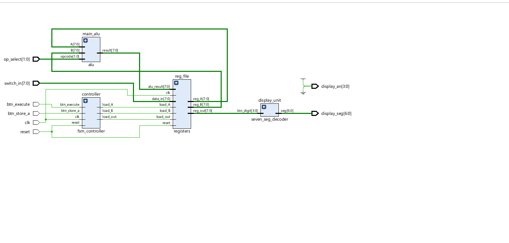
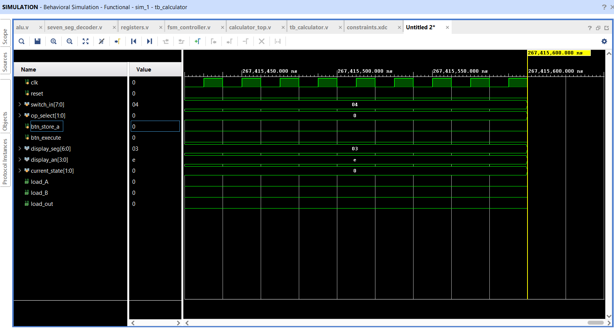
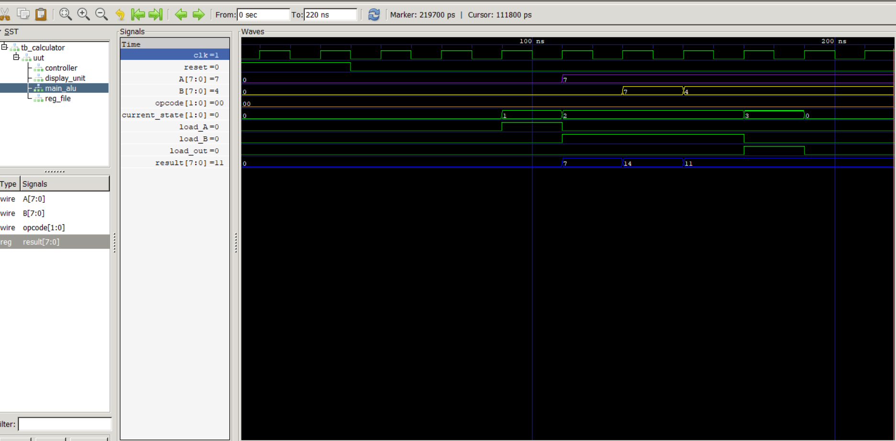
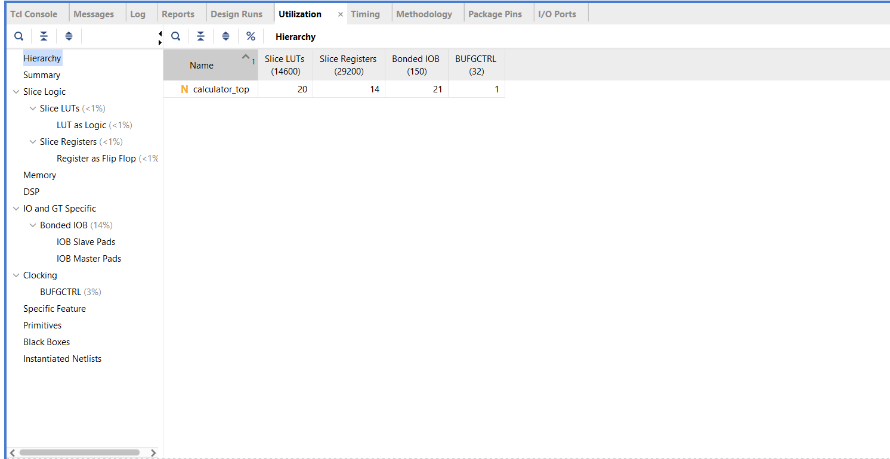
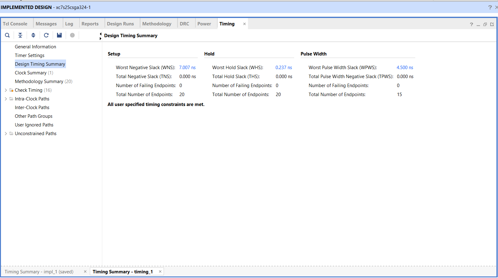

## 8-Bit Calculator System-on-Chip (SoC)

A synthesizable 8-bit calculator processor built with **Verilog HDL** and implemented on an **AMD/Xilinx Spartan-7 FPGA** (`xc7s25csga324-1`) using the **Vivado Design Suite**. The architecture features a decoupled control unit and datapath verified via cycle-accurate behavioral simulation.

---

## Architecture & Features

* **Finite State Machine (`fsm_controller.v`):** A synchronous Finite State Machine that acts as the system brain. It transitions between `IDLE`, `SAVE_A`, `SAVE_B`, and `EXECUTE` states based on push-button triggers, outputting precise write-enable control signals (`load_A`, `load_B`, `load_out`).
* **Arithmetic Logic Unit (`alu.v`):** A combinational execution block performing 8-bit Addition (`00`), Subtraction (`01`), bitwise AND (`10`), and bitwise OR (`11`).
* **Register File (`registers.v`):** Synchronous storage elements holding incoming switch data for Operand A and Operand B, as well as trapping the final ALU outcome for display persistence.
* **7-Segment Display Decoder and Driver (`seven_seg_decoder.v`, `calculator_top.v`):** Converts 4-bit nibbles into active-low segment patterns and drives a dynamic 20-bit refresh multiplexing counter to prevent segment flickering.

---

## FPGA Synthesis & Implementation Summary

The design was fully synthesized, placed, routed, and mapped to hardware pins using custom Xilinx Design Constraints (`.xdc`).

* **Target Device:** Spartan-7 (`xc7s25csga324-1`)
* **Clock Frequency:** 100 MHz (10 ns period)
* **Worst Negative Slack (WNS):** +7.007 ns (Timing Met)
* **Worst Hold Slack (WHS):** +0.237 ns

| Resource | Used | Available | Utilization % |
| :--- | :--- | :--- | :--- |
| **Slice LUTs (Look-Up Tables)** | 20 | 14,600 | < 1% |
| **Slice Registers (FFs) (Flip-Flops)** | 14 | 29,200 | < 1% |
| **Bonded IOB (Pins)** | 21 | 150 | 14% |
| **Clock Buffers (BUFG)** | 1 | 32 | 3% |

---

## Simulation and  Verification 

System behavior was validated using both **Behavioral Simulation** in Vivado and waveform verification via **GTKWave / Icarus Verilog**.

### Elaborated RTL Schematic


### Behavioral Simulation Waveform



### Resource Utilization Report


### Timing Summary Report


---

## Repository Directory Structure

```text
.
├── .gitignore                         # Keeps Vivado junk files off git
├── README.md                          # Project documentation
├── constraints/                       # Pin Mapping and Constraints
│   └── constraints.xdc                # Xilinx Design Constraints File 
├── docs/                              # Waveform and Reports
│   ├── rtl_schematic.png              # Screenshot of RTL Schematic 
│   ├── sim_waveform.png               # Screenshot of Behavioral simulation waveform
│   ├── timing_summary.png             # Screenshot of Timing Summary Report
│   |── utilization_summary.png        # Screenshot of Utilization Report       
├── rtl/                               # RTL Source Files
│   ├── alu.v                          # Combinational ALU Logic
│   ├── calculator_top.v               # Top-Level wrapper and clock driver 
│   ├── fsm_controller.v               # System control state machine 
│   ├── registers.v                    # Internal register storage
│   └── seven_seg_decoder.v            # Segment Decoder 
└── testbench/                         # Simulation Files
    └── tb_calculator.v                # Testbench for cycle verification

```
### Icarus Verilog & GTKWave Setup Instructions

To compile and simulate the project locally without opening Vivado:

### 1. Compile RTL source files along with the testbench
iverilog -o sim_out.vvp testbench/tb_calculator.v rtl/*.v

### 2. Run the simulation executable to generate the VCD waveform file
vvp sim_out.vvp

### 3. Open waveform viewer
gtkwave calculator_tb.vcd
